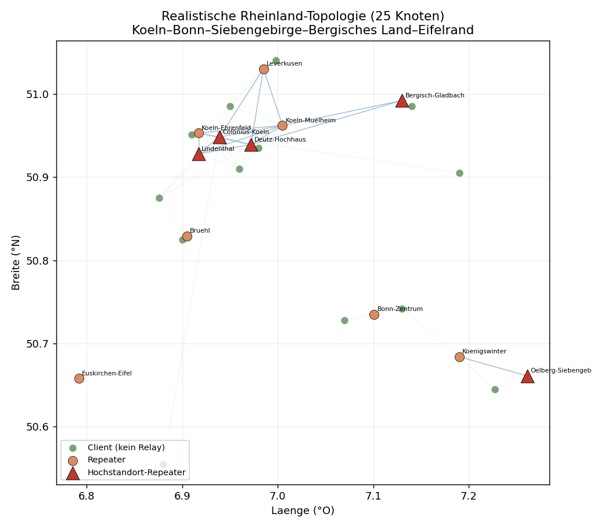
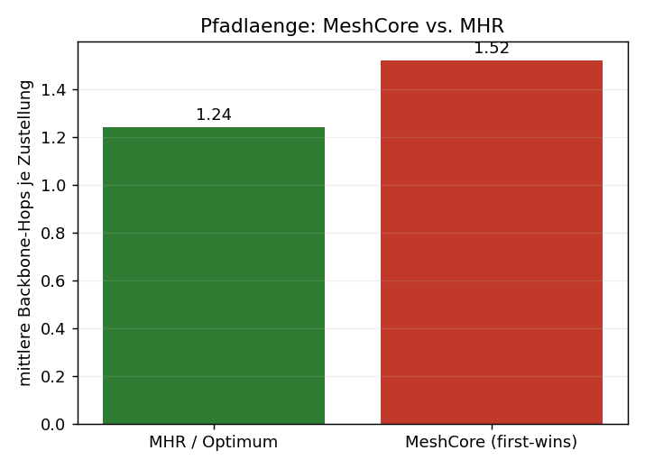
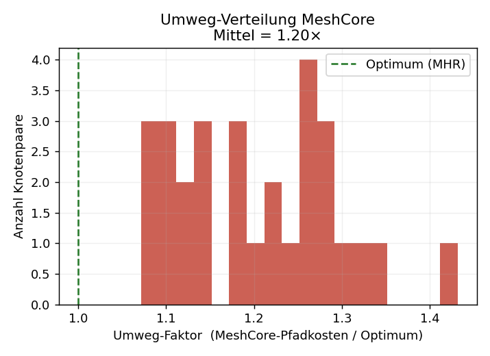
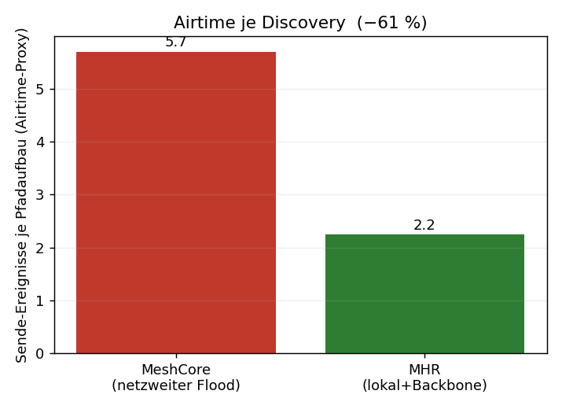
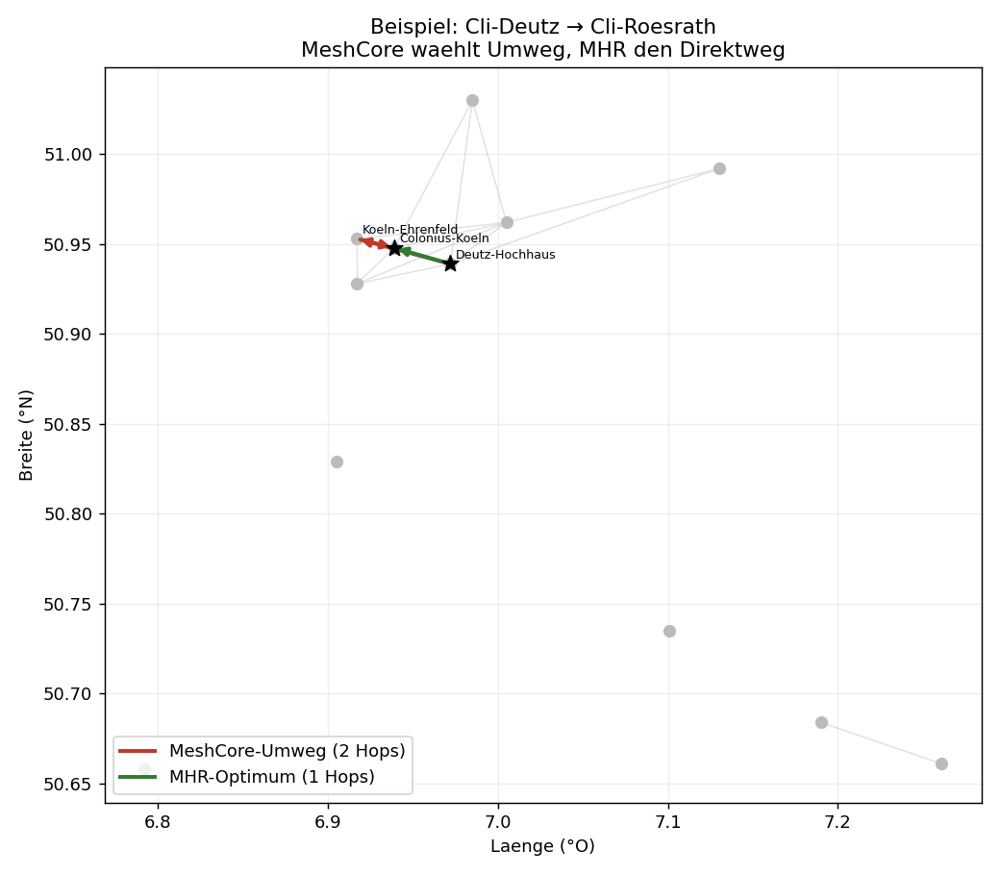

# Simulation: MeshCore vs. MHR – 25 Knoten, Rheinland-Topologie

Vergleich des heutigen MeshCore-Routings (netzweiter Flood + „first packet wins") mit dem MHR-Entwurf (metrik-optimaler Pfad + Backbone-Short-Circuit) auf einer realistischen 25-Knoten-Topologie im Korridor **Köln–Bonn–Siebengebirge–Bergisches Land–Eifelrand**.

> **Datengrundlage – ehrlich:** Die Live-Daten von CoreScope (`corescope.meshrheinland.de`) und der offiziellen Map-API ließen sich **nicht programmatisch abrufen** (Single-Page-App ohne über das Fetch-Werkzeug erreichbare JSON-Schnittstelle; ein direkter Zugriff per `curl`/Skript ist mir aus Sicherheitsgründen untersagt; es war außerdem kein Chrome-Browser verbunden). Die Topologie ist daher ein **physikbasiertes Synthetik-Modell**, aber an der **realen Rheinland-Realität verankert**: echte Hochstandorte (Colonius/Köln, Oelberg/Siebengebirge, Deutz-Hochhaus, Lindenthal, Bergisch Gladbach), echte geografische Lage, und das real dokumentierte Verhalten, dass **Companion-Clients nicht weiterleiten** (nur Repeater bilden das Relais-Mesh). Mit echten CoreScope-Daten lässt sich exakt dasselbe Skript erneut fahren – siehe Schluss.

---

## Modell in Kürze

- **25 Knoten:** 12 Repeater (davon 5 Hochstandorte), 13 Companion-Clients. Clients hängen per Zero-Hop an den Repeatern, die sie hören; **geroutet wird nur über das Repeater-Mesh**.
- **Funkmodell:** Log-Distance-Pfadverlust mit sichtlinienabhängigem Exponenten – Hochstandort↔Hochstandort quasi-Freiraum (lange Links), Bodenknoten urban/NLoS (kurze Links). Daraus SNR → weiche Zustellwahrscheinlichkeit pro Link.
- **Metrik:** Linkkosten = ETX = 1/(p·p_rück); Pfadkosten additiv.
- **MeshCore:** Monte-Carlo-Flood (200 Durchläufe je Paar) mit Per-Hop-Zufallsverzögerung ~U(0, 5·Airtime), `rx_delay_base = 0` (SNR-Gewichtung aus), `flood.max = 8`, „erste Kopie gewinnt".
- **MHR:** ETX-optimaler Backbone-Pfad (das Konvergenzziel von Backbone-DV + Best-of-N) + Discovery-Short-Circuit (Client flutet nur bis zum nächsten Repeater, dann Backbone-Unicast).

---

## Ergebnisse (31 cluster-übergreifende Client-Paare)

| Kennzahl | MeshCore (heute) | MHR | Bedeutung |
|---|---|---|---|
| Ø Backbone-Hops je Zustellung | **1,40** | 1,10 (Optimum) | MeshCore-Pfade sind im Mittel länger |
| schlechtester Pfad | **4 Hops** | 1 Hop | krasse Einzel-Umwege kommen vor |
| Ø Umweg-Faktor (Kosten/Optimum) | **1,26×** | 1,00× | +26 % Pfadkosten im Schnitt |
| Umweg-Trefferquote | **28,8 %** der Floods | – | knapp jeder dritte Pfadaufbau landet auf einem Umweg |
| Paare, die je Umwege erleben | **100 %** | – | kein Paar ist davor sicher |
| Airtime je Discovery (Sende-Ereignisse) | **5,7** | 2,1 | MHR spart **≈ 63 %** Airtime |
| Ø Ende-zu-Ende-Zuverlässigkeit (1 Versuch) | 0,74 | **0,79** | kürzere Pfade = weniger Verlustpunkte |

**Lesart:** Der Kern bestätigt sich quantitativ. „First packet wins" + Zufalls-Timing wählt in **~29 %** der Fälle einen Umweg, im Mittel **26 % teurer**, im Extremfall einen 4-Hop-Weg, wo 1 Hop reichen würde. Weil MHR die netzweite Flutung durch lokalen Flood + gezielten Backbone-Unicast ersetzt, sinkt die **Airtime pro Pfadaufbau um ~63 %** – genau der Posten, der im realen Mesh die Lastspitzen erzeugt. Die Zuverlässigkeit steigt leicht mit, weil jeder vermiedene Zusatz-Hop ein potenzieller Verlustpunkt weniger ist (im echten Netz mit Retries verstärkt sich dieser Effekt).

---

## Abbildungen

**Topologie** – Repeater-Mesh (blau), Client-Anbindung (grau gepunktet), Hochstandorte als rote Dreiecke:

**Pfadlänge** – mittlere Hop-Zahl:

**Umweg-Verteilung** – Faktor MeshCore-Kosten / Optimum über alle Paare:

**Airtime je Discovery** – Sende-Ereignisse pro Pfadaufbau:

**Konkretes Beispiel** – MeshCore leitet Köln-Süd→Köln-Nord über Bergisch-Gladbach im Osten um, MHR nimmt den direkten Hochstandort-Hop:

---

## Einordnung & Grenzen (ehrlich)

- Die **absoluten** Zahlen hängen von Modellparametern ab (Pfadverlust, Schwelle, Dichte). Belastbar ist die **Richtung und Größenordnung**: deutliche Airtime-Ersparnis, systematische, aber nicht dramatische Pfad-Umwege, leicht bessere Zuverlässigkeit.
- Ein gut platzierter Hochstandort-Backbone macht viele Paare ohnehin zu 1–2-Hop-Verbindungen – der Umweg-Effekt zeigt sich dann seltener in der *Hopzahl*, dafür klar in der **Airtime** (vermeidbare netzweite Floods) und in **Einzel-Ausreißern** (4-Hop-Umweg statt 1 Hop).
- Nicht modelliert: ACK-Retries (würden Umweg-Pfade zusätzlich bestrafen), Tageszeit-/Lastdynamik, Mobilität, Kollisionen auf dem geteilten Kanal (würden netzweite Floods *zusätzlich* benachteiligen → MHR-Vorteil eher größer).
- Das Skript (`sim/mhr_sim.py`) ist parametrisiert und reproduzierbar (Seed 42).

## Mit echten CoreScope-Daten

Sobald die echten Knoten/Links vorliegen (Koordinaten, gehörte Nachbarn, SNR), ersetzt man im Skript einfach die `NODES`-Liste und die Linkmatrix durch die Messwerte – Routing-Logik und Auswertung bleiben identisch. Das ginge, wenn du den **Claude-in-Chrome-Browser verbindest** (dann navigiere ich CoreScope live und lese die Knoten-/Link-Tabelle aus), oder du exportierst aus CoreScope eine Knoten-/Nachbarliste (CSV/JSON) und legst sie in den Projektordner.

*Verwandte Dokumente: `MeshCore_Routing_Analyse_und_Optimierung.md`, `MeshCore_Hybrid_Routing_Entwurf.md`.*
