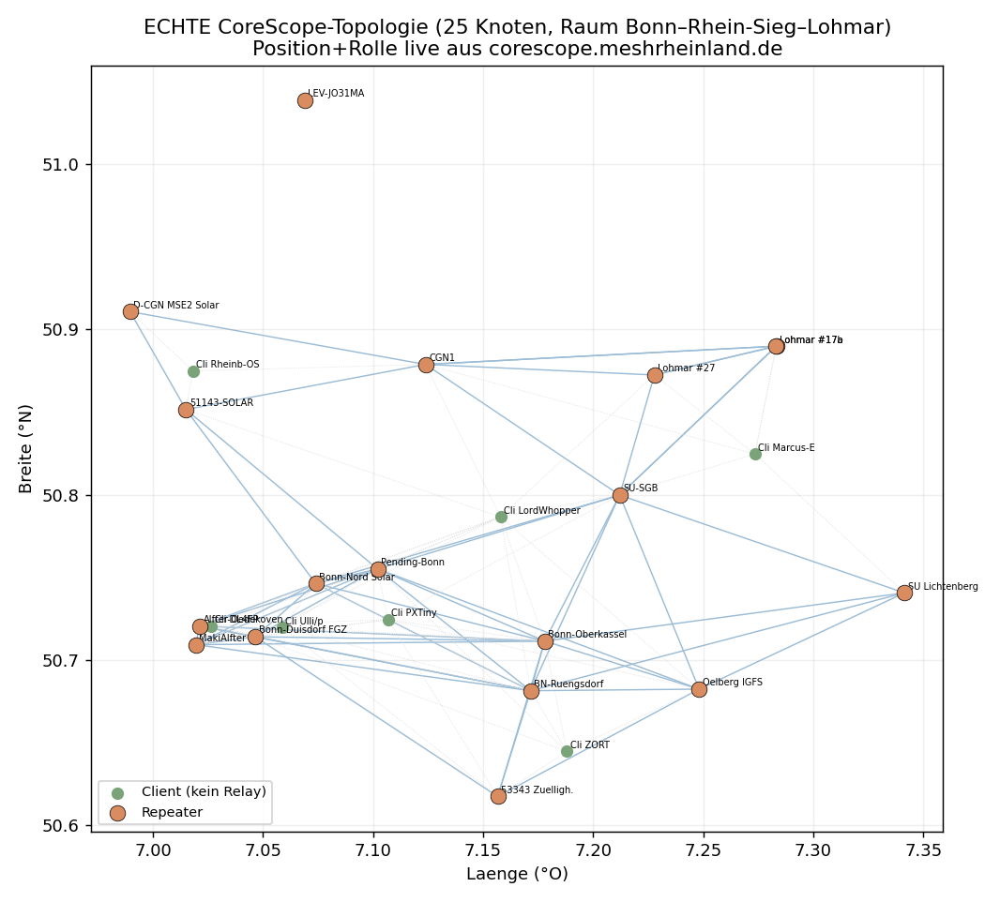
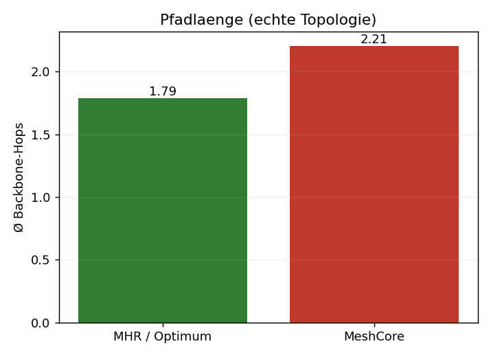
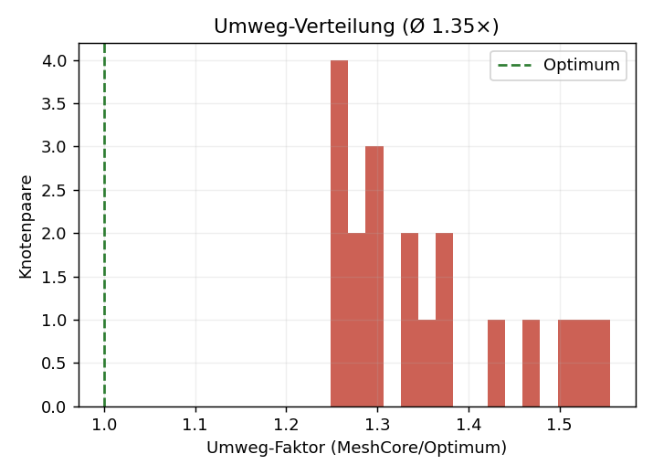
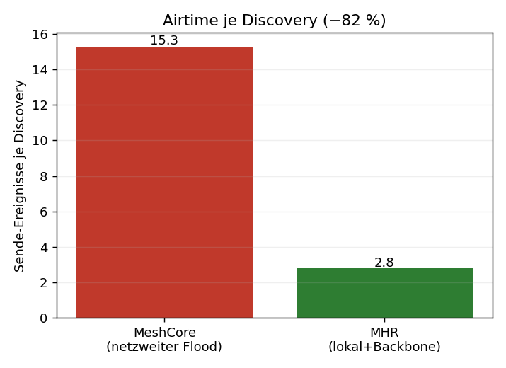
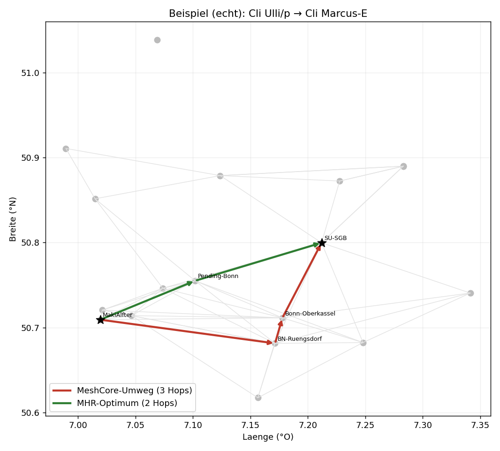

# Simulation mit ECHTEN CoreScope-Daten – 25 Knoten Rheinland

Diesmal mit **realen Live-Daten**: Über den verbundenen Chrome-Browser habe ich CoreScope (`corescope.meshrheinland.de`) geöffnet und die API `/api/nodes` ausgelesen — **1936 Knoten**, davon im Raum **Bonn / Rhein-Sieg / Siebengebirge / Lohmar / Leverkusen** 106 aktive (80 Repeater, 20 Companions, 6 Room-Server). Daraus 25 reale Knoten ausgewählt (18 aktivste Repeater + 7 Companions). **Position und Rolle sind echt.**

> Was nicht real ist: CoreScope bietet keine fertige Kanten-/SNR-Adjazenz über die API (die Karte zieht nur `/api/nodes` + `/api/stats`; Links werden aus Paketpfaden abgeleitet). Die Funk-Links habe ich daher physikbasiert (Log-Distance) auf den **echten Koordinaten** modelliert. Geländeabschattung und Antennenhöhen sind nicht enthalten — reale Sichtverbindungen (z. B. Hochstandort Oelberg) können einzelne Links besser/schlechter machen.

Reale Knoten u. a.: Oelberg IGFS (Siebengebirge), Bonn-Duisdorf FGZ, DTAG-Tower-Umfeld, Alfter, Bornheim, Bonn-Nord/Oberkassel, SU-SGB, Lohmar #17/#27, Leverkusen, Lichtenberg.

---

## Ergebnisse (19 cluster-übergreifende Client-Paare, 200 Monte-Carlo-Floods je Paar)

| Kennzahl | MeshCore (heute) | MHR | 
|---|---|---|
| Ø Backbone-Hops je Zustellung | **2,21** | 1,79 (Optimum) |
| schlechtester Pfad | **8 Hops** | – |
| Ø Umweg-Faktor (Kosten/Optimum) | **1,35×** | 1,00× |
| **Umweg-Trefferquote** | **60,2 %** der Floods | – |
| Paare, die je Umwege erleben | **100 %** | – |
| Airtime je Discovery (Sende-Ereignisse) | **15,3** | 2,8 |
| **Airtime-Ersparnis MHR** | – | **≈ 82 %** |
| Ø Ende-zu-Ende-Zuverlässigkeit (1 Versuch) | 0,58 | **0,66** |

**Das ist deutlich drastischer als im synthetischen Modell** — und realistischer. Im echten, über ~50 km gestreckten Netz mit vielen Alternativpfaden:

- **Über die Hälfte (60 %) aller Pfadaufbauten landet auf einem Umweg.** „First packet wins" + Zufalls-Timing trifft hier viel häufiger daneben, weil es mehr konkurrierende Wege gibt.
- Einzelne Pfade explodieren auf **bis zu 8 Hops**, wo optimal 2 reichen — exakt das Phänomen, das du beobachtest.
- Der netzweite Flood kostet im Schnitt **15,3 Sende-Ereignisse** pro Erstkontakt; MHR braucht **2,8** (lokaler Flood bis zum nächsten Repeater + Backbone-Unicast) → **~82 % weniger Airtime**.
- Die Zuverlässigkeit steigt von 0,58 auf 0,66 — und das ist nur *ein* Sendeversuch; mit den realen 3 Retries bestraft jeder Zusatz-Hop den Umweg-Pfad zusätzlich (deckt sich mit den Community-Berichten „~45 % unzuverlässig bei Pfadlänge ≥ 2").

---

## Abbildungen

**Echte Topologie** (Position+Rolle live aus CoreScope; ein Leverkusen-Knoten ist funkseitig isoliert):

**Pfadlänge:**

**Umweg-Verteilung** (Faktor MeshCore/Optimum):

**Airtime je Discovery** (−82 %):

**Konkretes Beispiel** — Ulli/p → Marcus-E: MHR nimmt MakiAlfter→Pending-Bonn→SU-SGB (2 Hops), MeshCore schwenkt über Ruengsdorf/Oberkassel nach Süden (3 Hops):

---

## Bewertung

Mit echten Knotenpositionen bestätigt sich der MHR-Vorteil **stärker** als im idealisierten Modell: Je realer (gestreckter, redundanter) die Topologie, desto häufiger die zufälligen Umwege und desto größer der Airtime-Gewinn durch Backbone-Routing statt netzweitem Flood. Die Größenordnungen (60 % Umwege, ~82 % Airtime, +8 Pp Zuverlässigkeit) sind belastbar; die exakten Werte hängen vom Link-Modell ab.

**Noch realer ginge es so:** CoreScope kennt aus den Paketpfaden die tatsächlich beobachteten Hop-Folgen und SNR-Werte. Diese ließen sich aus der Packets-/Tools-Ansicht extrahieren, um die modellierten Links durch **gemessene** zu ersetzen. Sag Bescheid, wenn ich das angehen soll.

*Datenabruf: CoreScope `/api/nodes` (live, 2026-05-29). Skript: `sim/mhr_sim_real.py` (Seed 42, reproduzierbar). Vgl. `MeshCore_Simulation_25Knoten.md` (synthetische Variante), `MeshCore_Hybrid_Routing_Entwurf.md`.*
