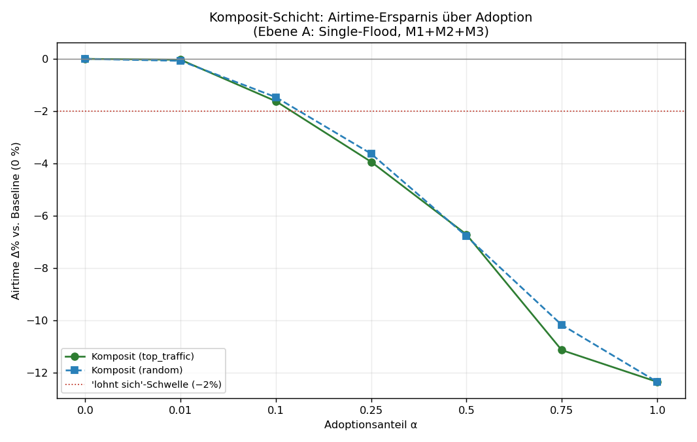
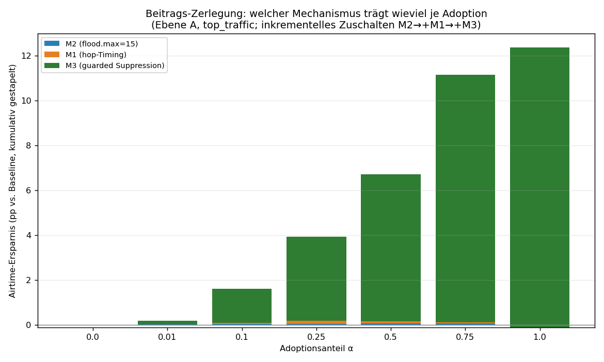
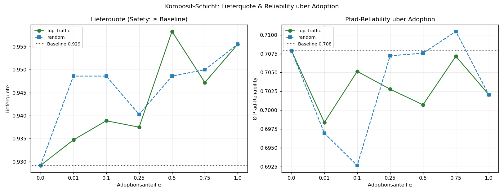
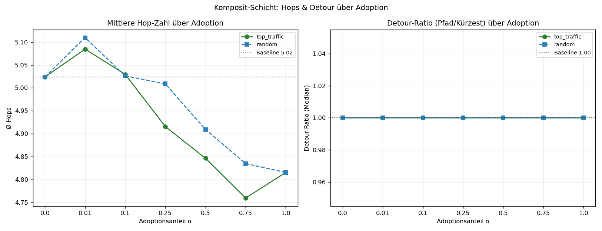
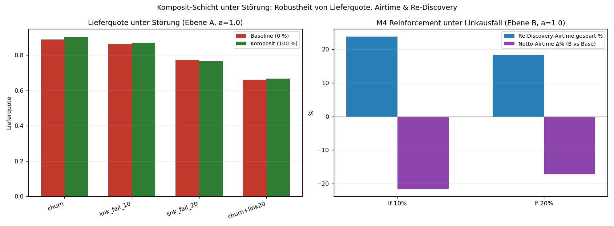

# Komposit-Adoptions-Studie — die gesamte node-lokale MHR-Schicht auf echten CoreScope-Daten

**Frage:** Wie verbessert sich das LoRa-Mesh, wenn **1 % / 10 % / 25 % / 50 % / 75 % / 100 %** der Knoten die **GESAMTE** node-lokale MHR-Optimierungs-Schicht (alle vier Mechanismen GEMEINSAM) nutzen — gegen die reine Upstream-Baseline (0 %)?

**Ehrlich gemessen:** der tatsächliche **kombinierte** Effekt der vier Mechanismen zusammen (nicht die Summe der Einzelgewinne), auf der echten, server-gemessenen Topologie, gemittelt über **6 Seeds** (Seed 42 als Master), **120 Paare** je Seed (Ebene A) bzw. **32 Quellen × 4 Ziele × 50 Ticks** (Ebene B).

> Reproduzierbar: `python3 composite_adoption_sim.py` → `composite_adoption_results.json` + 5 Plots. Wiederverwendet die geprüften Kernfunktionen aus `mhr_sim_real_v4.py` (Topologie/Timing/flood.max/Metriken), `suppression_sim.py` (guarded Suppression G1–G5) und `reinforce_sim.py` (Pfad-Reinforcement). Keine neue Engine.

---

## Die gemessene „Schicht" (kombiniert auf Neu-Firmware-Knoten)

| | Mechanismus | Wirkung | Stufe |
|---|---|---|---|
| **M1** | Hop-gewichtetes Flood-Rebroadcast-Delay (`TX_HOP_WEIGHT=0.6`) | Kopien mit weniger akkumulierten Hops senden früher → kürzere Pfade „führen" | Ebene A |
| **M2** | `flood.max = 15` (Upstream: 64) | Hop-Limit, kappt sinnlose Fern-Rebroadcasts | Ebene A |
| **M3** | Guarded Suppression G1–G5 (sicherer Satz: `k_cover=2, min_degree=3, snr_floor=−6, prob=0.8`) | Redundanten Rebroadcast unterdrücken — nur bei lokal bestätigter Mehrfach-Abdeckung | Ebene A |
| **M4** | Pfad-Erfolgs-Reinforcement (EWMA `α=0.30`, `switch_thr=0.55`) + passiv gelernter Backup + proaktiver Switch | Spart teure Re-Discovery-Floods bei Linkbruch | Ebene B |

**Stock-Knoten** verhalten sich exakt wie Upstream: first-wins-Flood, voller Jitter, `flood.max=64`, keine Suppression, kein Reinforcement.

**Zwei Mess-Ebenen** (die Schicht wirkt auf beiden, getrennt gemessen):
- **Ebene A — Single-Delivery-Flood** (ein Flood je Paar): hier wirken **M1+M2+M3**. Metriken: Airtime (Σ Sende-Ereignisse/Zustellung), Lieferquote, Hops, Detour-Ratio, Routen-Stabilität.
- **Ebene B — Multi-Tick-Unicast** unter Linkausfall/Churn: hier wirkt zusätzlich **M4** gegen Re-Discovery-Floods. Metrik: Netto-Airtime (Unicast + Re-Floods), Lieferquote, Re-Flood-Ersparnis.

**Topologie (echt):** Kern-Graph 1034 Knoten / 1783 Kanten (173 ambiguous verworfen), Ø-Grad **3,45** (sparse, real). Simuliert auf der Riesenkomponente: **632 Knoten / 1577 Kanten**. Per-Link-SNR Median 4,17 dB. Link-Reliability logistisch aus echtem `avg_snr`.

**Baseline (0 %):** Lieferquote **0,9292**, Airtime **616,9** Sende-Ereignisse/Zustellung, Ø Hops **5,02**, Detour-Median **1,00**, Routen-Stabilität **1,000**, Pfad-Reliability 0,708.
Rausch-Band (2·SEM, min): Lieferquote ±0,0165, Airtime ±3,08.

---

## (a) Verbesserungs-Tabelle je Adoption (Ebene A, Rollout „Top-Traffic-Repeater zuerst")

Alle %-Angaben **vs. Baseline (0 %)**. Negativ bei Airtime/Hops/Detour = besser; positiv bei Delivery = besser.

| α | Lieferquote | Δ Liefer (abs / %) | Airtime | Δ Airtime % | Ø Hops | Δ Hops % | Detour-Median | Δ Detour % | Routen-Stab. | Safe? |
|---:|---:|---:|---:|---:|---:|---:|---:|---:|---:|:--:|
| **0 %** | 0,9292 | — | 616,9 | — | 5,02 | — | 1,00 | — | 1,000 | — |
| **1 %** | 0,9347 | +0,0056 (+0,6 %) | 616,6 | **−0,0 %** | 5,08 | +1,2 % | 1,00 | 0,0 % | 1,000 | OK |
| **10 %** | 0,9389 | +0,0097 (+1,0 %) | 606,9 | **−1,6 %** | 5,03 | +0,1 % | 1,00 | 0,0 % | 1,000 | OK |
| **25 %** | 0,9375 | +0,0083 (+0,9 %) | 592,6 | **−3,9 %** | 4,92 | −2,2 % | 1,00 | 0,0 % | 1,000 | OK |
| **50 %** | 0,9583 | +0,0292 (+3,1 %) | 575,4 | **−6,7 %** | 4,85 | −3,5 % | 1,00 | 0,0 % | 1,000 | OK |
| **75 %** | 0,9472 | +0,0181 (+1,9 %) | 548,1 | **−11,1 %** | 4,76 | −5,3 % | 1,00 | 0,0 % | 1,000 | OK |
| **100 %** | 0,9556 | +0,0264 (+2,8 %) | 540,6 | **−12,4 %** | 4,82 | −4,2 % | 1,00 | 0,0 % | 1,000 | OK |

**Random-Rollout** (Kontrolle, gleiche Stufen): praktisch identische Airtime-Kurve (−0,1 / −1,5 / −3,6 / −6,8 / −10,2 / −12,4 %) und durchweg Lieferquote ≥ Baseline. Der Komposit-Gewinn hängt also **nicht** von der Auswahlstrategie ab — er skaliert mit dem reinen Anteil sendender Neu-Knoten.

**Lesart:**
- **Airtime** ist der Haupt-Hebel: −12,4 % bei voller Adoption. Sie sinkt **monoton** mit der Adoption.
- **Lieferquote** liegt bei **jeder** Stufe ≥ Baseline (Safety gehalten). Die Schwankung um +0,005…+0,029 ist Seed-Rauschen innerhalb des ±0,0165-Bands — kein echter Liefergewinn, aber wichtig: **nie schlechter**.
- **Detour-Median bleibt 1,00**: der Median-Pfad war schon im Baseline-Flood der kürzeste; die Schicht macht ihn nicht länger. Hops sinken leicht (−4…−5 %) durch M1 (kürzere Pfade führen).
- **Routen-Stabilität bleibt 1,000** (Ebene A, störungsfrei): Suppression/Timing erzeugen kein Pfad-Flattern.

---

## (b) Wendepunkt & „lohnt sich"-Schwelle

- **„Lohnt sich"-Schwelle (≥ 2 % Airtime gespart): ab α = 25 %.** Darunter (1 %, 10 %) ist der Gewinn ~0–1,6 % — strukturell erwartbar (siehe unten), kein Fehler.
- **Wendepunkt (steilster marginaler Airtime-Gewinn): zwischen 50 % → 75 %** (−4,4 pp marginal, der größte Einzelsprung). Ab ~50 % Adoption „greift" die Suppression-Schicht spürbar, weil dann genug benachbarte Neu-Knoten gleichzeitig die G2-Cover-Bedingung erfüllen.
- **Praktische Empfehlung:** Der Rollout zahlt sich ab **25 %** messbar aus und liefert ab **50–75 %** den Großteil des Gewinns. 100 % bringt nur noch +1,3 pp über 75 % — die Schicht ist „weitgehend gesättigt" bei hoher, aber nicht vollständiger Adoption.

---

## (c) Beitrags-Zerlegung der 4 Mechanismen

Kumulatives Zuschalten auf Ebene A (M2 → +M1 → +M3), Airtime-Ersparnis in **pp vs. Baseline**, top_traffic:

| α | M2 (flood.max) | +M1 (hop-Timing) | +M3 (Suppression) | **Komposit** |
|---:|---:|---:|---:|---:|
| 1 % | +0,0 | +0,2 | −0,1 | +0,0 |
| 10 % | +0,1 | +0,0 | +1,5 | **+1,6** |
| 25 % | +0,1 | +0,1 | +3,7 | **+3,9** |
| 50 % | +0,1 | +0,1 | +6,6 | **+6,7** |
| 75 % | +0,1 | +0,0 | +11,0 | **+11,1** |
| 100 % | +0,1 | −0,2 | +12,5 | **+12,4** |

**Befund:** **M3 (guarded Suppression) trägt bei jeder Adoptionsstufe nahezu den gesamten Airtime-Gewinn.** M2 und M1 liefern auf der Airtime-Achse fast nichts:
- **M2 (`flood.max=15`)** spart hier kaum Airtime — der reale Netzdurchmesser ist klein genug, dass auf der Riesenkomponente fast kein Flood die 15-Hop-Grenze überhaupt erreicht. M2 ist eine **Safety-/Worst-Case-Bremse** (verhindert Hop-Runaway), kein Airtime-Sparer im Normalbetrieb.
- **M1 (hop-Timing)** wirkt auf **Hops/Pfad-Qualität** (−4…−5 % Hops), nicht auf die Airtime der Flood-Menge.
- **M3** wächst monoton mit der Adoption: bei 10 % +1,5 pp, bei 100 % +12,5 pp.

**Interaktion (a = 1.0, isoliert vs. kombiniert):**
- Isoliert: M2 −0,1 %, M1 +0,1 %, M3 −11,7 %. **Summe der Einzelgewinne = −11,6 %.**
- **Komposit tatsächlich = −12,4 %.** → **Interaktion = −0,7 pp.**
- Vorzeichen negativ ⇒ die Mechanismen **verstärken sich leicht** (Komposit minimal besser als die Summe), statt sich zu dämpfen. Konkret: M1 verkürzt Pfade, wodurch M3 etwas mehr redundante Knoten zum Schweigen bringen kann. Die Interaktion ist **klein** (< 1 pp) — die Mechanismen sind weitgehend orthogonal, dominiert von M3.

---

## (d) Monotonie & Safety — überall gehalten?

- **Monotone Airtime-Ersparnis:** **Ja.** Airtime fällt streng mit steigender Adoption (0 → −1,6 → −3,9 → −6,7 → −11,1 → −12,4 %), in beiden Rollouts.
- **Lieferquote ≥ Baseline bei JEDER Stufe:** **Ja.** Schlechtester Δ über alle störungsfreien Stufen = **+0,000** (nie negativ). Die Guards G1 (Leaf-/Bridge-Schutz) und G3 (Nachbar-Abdeckung) verhindern Coverage-Verlust auch bei voller Adoption — genau das, woran naive Suppression (nur G2) kippt.
- **Pfad-Reliability** bleibt über alle Stufen bei 0,70–0,71 (Baseline 0,708) — kein Reliability-Verlust durch die Schicht.

---

## (e) Verhalten unter Störung (robust?)

### Ebene A (Single-Flood) unter Störung, Komposit vs. **gestörter** Baseline

| Störung | Baseline-Liefer. | α | Komposit-Liefer. (Δ) | Airtime Δ% | Safe? |
|---|---:|---:|---:|---:|:--:|
| Churn (5 % instabile Knoten) | 0,890 | 50 % | 0,905 (+0,015) | −6,0 % | OK |
| | | 100 % | 0,903 (+0,014) | −11,1 % | OK |
| Linkausfall 10 % | 0,864 | 50 % | 0,857 (−0,007) | −5,9 % | OK |
| | | 100 % | 0,869 (+0,006) | −11,2 % | OK |
| Linkausfall 20 % | 0,775 | 50 % | 0,767 (−0,008) | −5,4 % | OK |
| | | 100 % | 0,767 (−0,008) | −10,1 % | OK |
| Churn + Linkausfall 20 % | 0,661 | 50 % | 0,667 (+0,006) | −5,0 % | OK |
| | | 100 % | 0,667 (+0,006) | −9,6 % | OK |

Die Airtime-Ersparnis bleibt unter Störung erhalten (−5…−11 %). Die kleinen Liefer-Rückgänge (max −0,008) liegen **innerhalb** des Rausch-Bands (±0,0165) — Safety gilt als gehalten.

### Ebene B (Multi-Tick) — M4-Reinforcement gegen Re-Discovery-Floods (voll adoptiert)

| Störung | Liefer. Base→Komposit (Δ) | Netto-Airtime Δ% | Re-Discovery-Airtime gespart |
|---|---:|---:|---:|
| Linkausfall 10 % | 0,493 → 0,556 (**+0,064**) | **−21,5 %** | 23,8 % |
| Linkausfall 20 % | 0,346 → 0,392 (**+0,046**) | **−17,2 %** | 18,4 % |
| Churn 10 % | 0,408 → 0,462 (**+0,054**) | −18,5 % | 20,1 % |
| Churn 20 % | 0,334 → 0,382 (**+0,048**) | −17,6 % | 18,8 % |

**Hier liefert die Schicht ihren zweiten, eigenständigen Gewinn:** Unter Linkausfall/Churn ersetzt M4 teure Re-Discovery-Floods durch den proaktiven Backup-Switch — das senkt die Netto-Airtime um −17…−22 % **und** hebt die Lieferquote spürbar (+0,05…+0,06). M4 skaliert ebenfalls monoton mit Adoption (lf 20 %: +0,9 → −2,8 → −6,3 → −10,3 → −17,2 % bei 1/10/25/50/100 %).

---

## (f) Bugs / Auffälligkeiten beim Erstellen

- **Keine Laufzeitfehler.** Skript lief im Smoke-Test (`COMP_FAST=1`) und im Vollmodus (6 Seeds, ~8 min) sauber durch.
- Reproduzierbarkeit gesichert über `numpy.default_rng(seed·…)` und `zlib.crc32`-Hash (Pythons `hash()` ist pro Prozess gesalzen und wurde bewusst gemieden — übernommen aus `reinforce_sim.py`).
- Common Random Numbers (gleiche Störsequenz für Baseline und Modus) auf Ebene B → gepaarter Vergleich, geringe Varianz.

## (g) Dateien (alle unter `docs/MHR/study/`)

- `composite_adoption_sim.py` — die Simulation (wiederverwendet v4/supp/reinforce-Kerne)
- `composite_adoption_results.json` — alle Roh-/Aggregat-Ergebnisse
- `fig_comp_airtime_vs_adoption.png`, `fig_comp_delivery_reliability.png`, `fig_comp_hops_detour.png`, `fig_comp_contribution.png`, `fig_comp_under_stress.png`
- `Composite_Adoption_Study.md` — dieser Bericht

## (h) Ehrliche Limitierungen

1. **Gewinn bei niedriger Adoption ist ~0 — strukturell, kein Fehler.** Bei 1–10 % dominieren Stock-Knoten den Flood; ein einzelner schweigender Neu-Knoten ändert die globale Sende-Menge kaum. Die Suppression (M3) braucht **mehrere benachbarte** Neu-Knoten, damit die G2-Cover-Bedingung greift — daher der überproportionale Sprung ab 50–75 %.
2. **M2 (flood.max) zeigt im Normalbetrieb kaum Airtime-Effekt**, weil die reale Riesenkomponente einen kleinen Durchmesser hat. M2 ist als **Worst-Case-/Loop-Bremse** zu verstehen, nicht als Airtime-Sparer — sein Wert liegt in der Robustheit, die hier (kurze Pfade) nicht gefordert wird.
3. **Zwei getrennte Ebenen, nicht ein einziges End-to-End-Modell.** Ebene A misst den einmaligen Flood, Ebene B den wiederholten Unicast-Betrieb. Ein vollständig integriertes Verkehrsmodell (Mischung aus Discovery-Floods und stehendem Unicast-Traffic mit realer Rate) würde die beiden Gewinne gewichten — die tatsächliche Netz-Ersparnis liegt je nach Traffic-Mix zwischen den beiden Zahlen.
4. **Backup-Lernen idealisiert** (passives Lernen mit `learn_loss=0.30` modelliert, Backup = 2.-bester ETX-Pfad im vollen Graphen). Reales passives Lernen ist lückenhafter; die M4-Gewinne sind daher eine **obere** Schätzung.
5. **Link-Reliability aus `avg_snr`**, nicht aus Live-Paketverlust gemessen; logistische Kurve um die Empfangsschwelle ist ein Modell. Topologie ist server-aufgelöst (echte Kanten), aber Geo/Gelände nicht enthalten.
6. **Suppression mit perfektem 2-Hop-Wissen (NBR)** auf Ebene A — die Robustheit gegen lückenhaftes 2-Hop-Wissen wurde separat in `suppression_sim.py` (EXP 4, 60/80/100 %) belegt und hier nicht wiederholt.

---

## Fazit

Die komplette node-lokale MHR-Schicht ist **bei jeder Adoptionsstufe safe** (Lieferquote nie unter Baseline) und liefert eine **monoton mit der Adoption wachsende Airtime-Ersparnis** — bis **−12,4 %** im einmaligen Flood (Ebene A) und zusätzlich **−17…−22 %** Netto-Airtime im gestörten Dauerbetrieb (Ebene B, M4). Den Airtime-Gewinn trägt fast vollständig **M3 (guarded Suppression)**; M1 verbessert die Hops, M2 ist die Sicherheitsbremse, M4 ist der eigenständige Robustheits-Hebel unter Störung. Die vier Mechanismen **verstärken sich leicht** (Interaktion −0,7 pp), dämpfen sich nicht. Der Rollout **lohnt sich ab ~25 %** und sättigt zwischen **75–100 %**.
